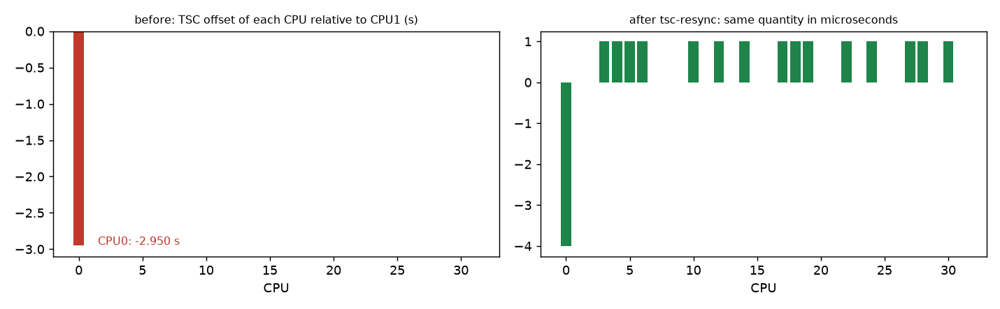
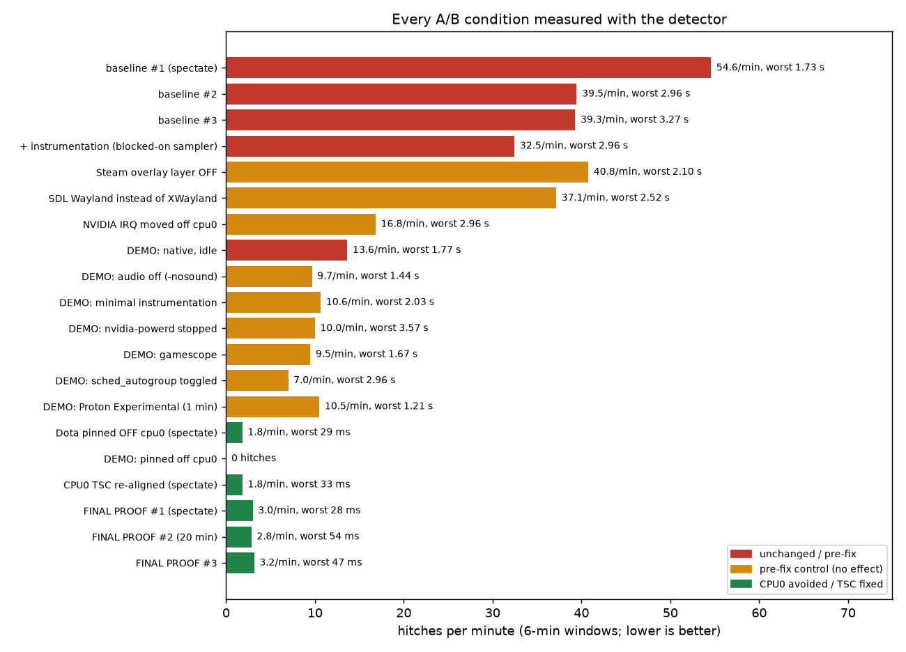
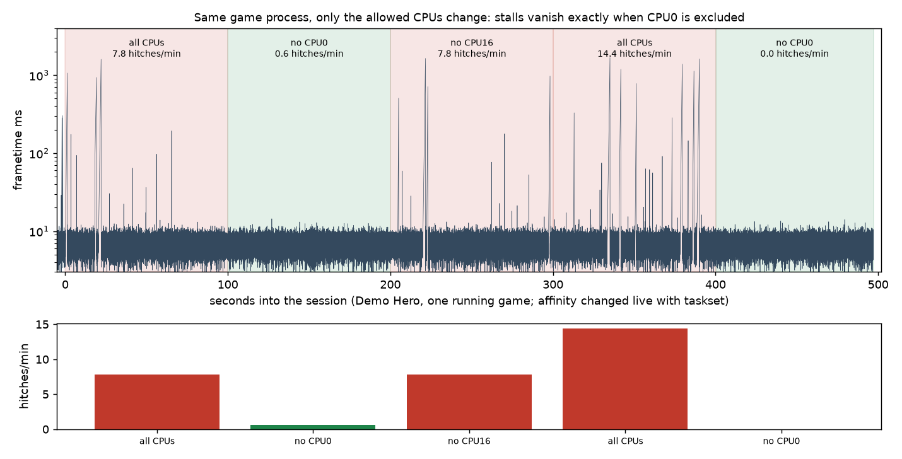
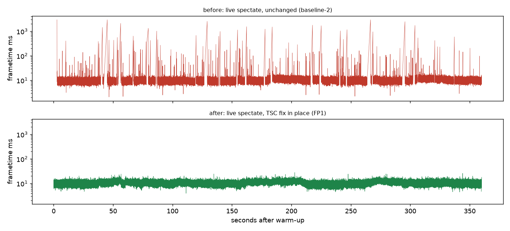

# Dota 2 (and other Source 2 games) stutter on Linux: CPU0's TSC is skewed by firmware

**TL;DR** — If Dota 2 / CS2 freezes for 0.1–3 s at irregular intervals on an AMD laptop (seen on a Ryzen 9 7945HX + RTX 4080 Laptop, CachyOS, kernel 6.18 LTS, KDE Plasma Wayland) while the GPU sits idle and frametimes are otherwise fine, check this first:

```sh
journalctl -k -b | grep -i "TSC warp"                      # "Measured … cycles TSC warp between CPUs, turning off TSC clock"
cat /sys/devices/system/clocksource/clocksource0/current_clocksource   # "hpet" instead of "tsc"
gcc -O2 -o tsc-check tools/tsc_check.c && ./tsc-check 32    # one CPU (cpu0) several seconds away from all the others?
```

On the machine studied here the firmware left **CPU0's TSC 2.950 s behind the other 31 CPUs**. The kernel notices, marks TSC unstable and uses HPET, but user space still executes raw `rdtsc`. Source 2 uses it for spin/timeout loops, so whenever a thread migrates onto CPU0 it can stall for up to the offset — and every other thread waits for it. Result: hitches of 70 ms … 2.96 s, 30–55 per minute in a live spectated match, **independent of GPU, driver, compositor, Proton/native, SDL backend, audio, overlay, or any launch option** (all ruled out by A/B measurement).

**Fix that worked (live-spectate hitches 39–55/min → ~3/min, worst hitch 3.3 s → 54 ms; 20-minute confirmation run included):**
1. Re-align CPU0's TSC with another CPU at every boot/resume — `tools/tsc_resync.c` + `ledger/install/tsc-resync.service` (writes MSR 0x10 via `/dev/cpu/0/msr`; **needs root, you do this at your own risk; AMD Zen 4 tested only**). It runs as root at every boot/resume, so it must be installed `root:root` in root-owned directories (`sudo install -o root -g root …`, then verify with `stat`); see "Build and install (root-owned)" and the full uninstall in [`REPORT.md`](REPORT.md) §2 before running anything. Needs the `msr` module, taints the kernel, and is blocked by Secure Boot/lockdown.
2. No-root fallback: keep the game off CPU0 — Steam launch option `taskset -c 1-31 %command% …` (measured equally good).
3. Proper fix: update the BIOS/EC; if the "TSC warp" line disappears, you don't need 1 or 2.

### The evidence in four pictures

| | |
|---|---|
|  |  |
|  |  |

1. CPU0's TSC is 2.950 s behind CPUs 1–31 (top left); fixed to microseconds by `tsc-resync`.
2. Every one of ~20 conditions measured: nothing but avoiding CPU0 / fixing the TSC changes the hitch rate (top right).
3. Same game process, only the allowed-CPU mask changes: stalls disappear exactly when CPU0 is excluded (bottom left).
4. Live spectate before (top, 40 hitches/min, up to 3 s) vs after (bottom, 3/min, ≤ 54 ms) — same detector, same match type (bottom right).

Read **[REPORT.md](REPORT.md)** for the full evidence (same-session affinity A/B, plots, what was ruled out, caveats). 

## What is in this repo
* `REPORT.md` — root cause, fix, proof, caveats, re-tests of common tweaks (`-threads`, `fps_max`, Proton, …)
* `bin/stutter` + `detector/` — a frametime **stutter detector** (MangoHud + system collectors on one clock; hitch/periodicity/correlation analysis; A/B `compare`; a statistical "fixed" check). Docs: `docs/README-detector.md`, validation in `docs/VALIDATION*.md`, spec in `docs/SPEC-detector.md`.
* `tools/` — `tsc_check.c`, `tsc_resync.c`, per-CPU affinity/sysctl phase scripts, live-trial launcher (`live_start.sh`, `dota-wrap.sh`), scheduler/stack analysis scripts
* `LEDGER.md` — every change with its revert command; `results/` — per-run reports, verdicts, hitch lists and gzipped frametimes for all live runs (`results/live/*`) and detector validation runs (`results/validation/*`)
* `docs/RESEARCH-dota-linux-stutter.md` — literature/issue-tracker research; `docs/ANALYSIS-sched-stalls.md` — scheduler-trace analysis

## Privacy / provenance
Personal identifiers (full name, e-mail, local user name, hostname, Steam ID, network interface names, friend/player names) have been removed; screenshots, raw MangoHud logs and system journals are not included. Timings and numbers are as measured. The investigation was run with an AI agent (Claude Code) orchestrating several worker agents; every change and measurement is in the ledger.

License: MIT.
