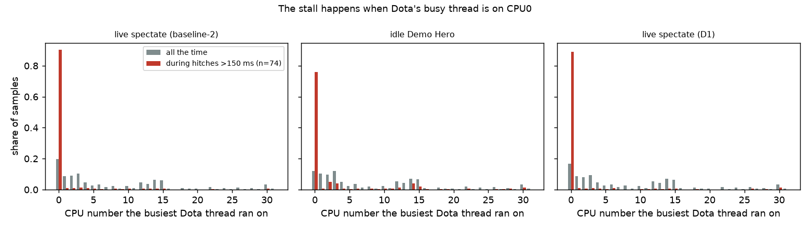
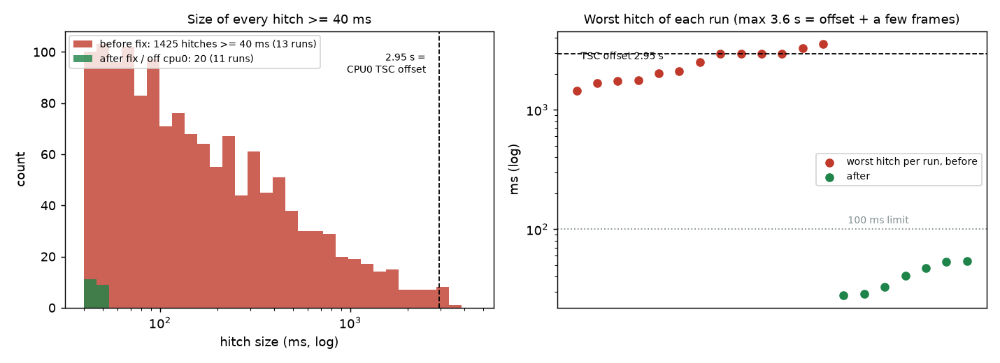
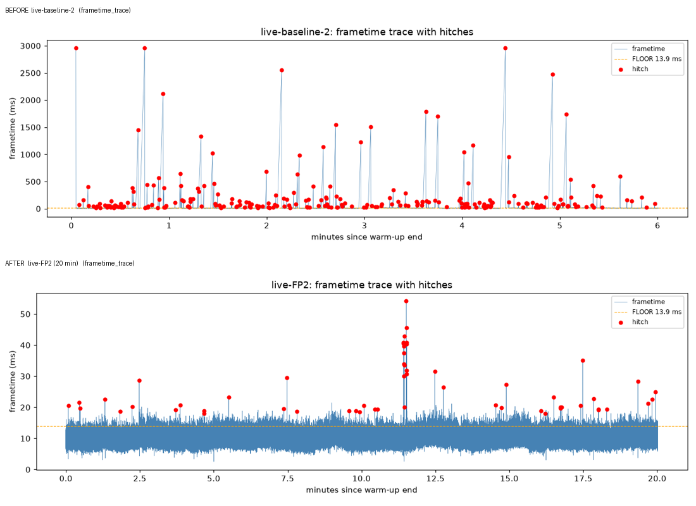
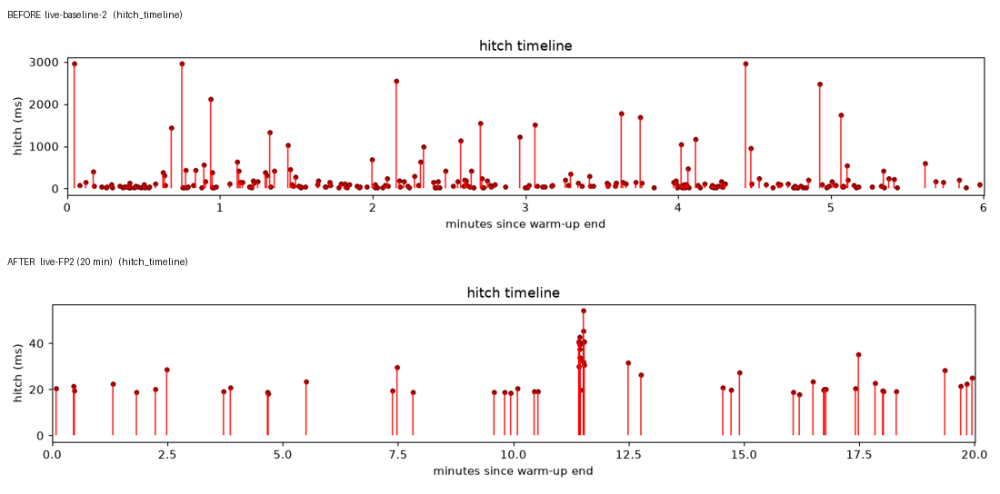
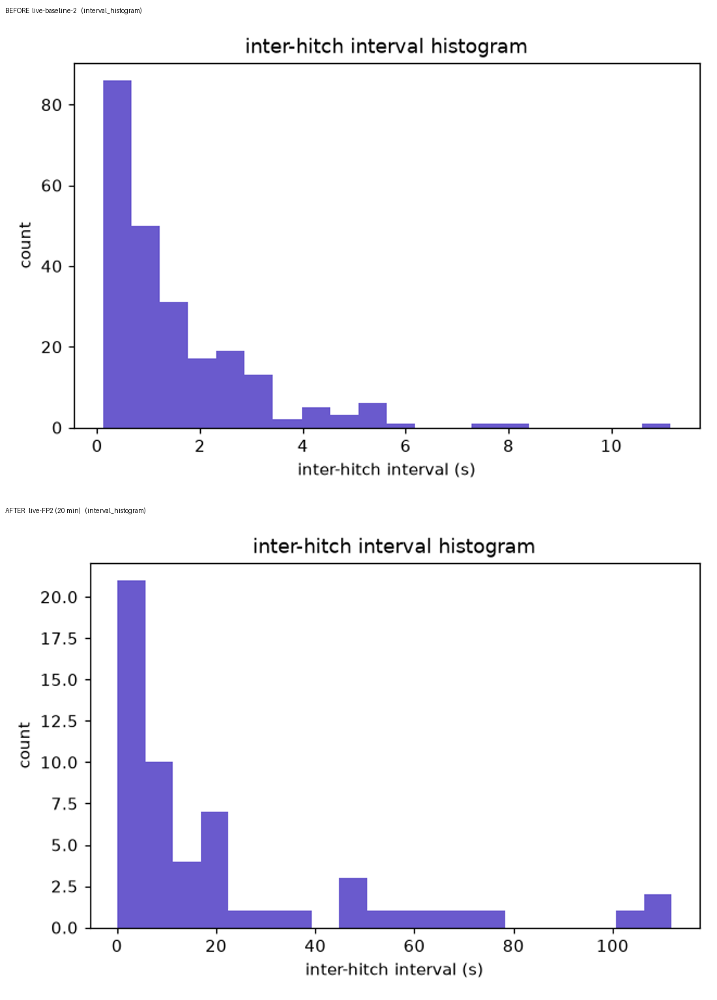
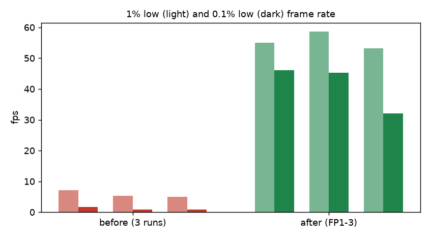
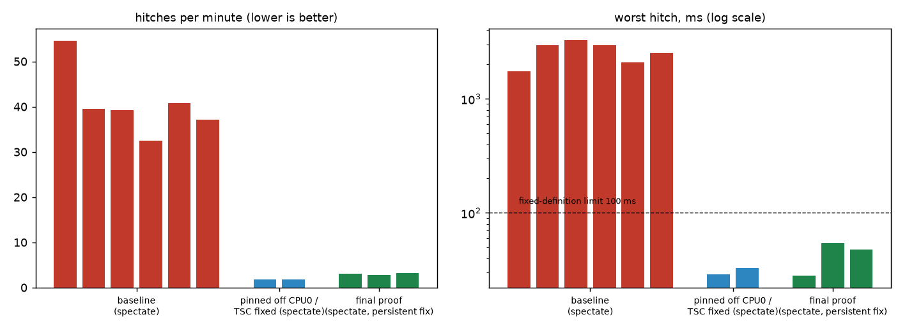

# Dota 2 stutter — root cause, fix, proof

**Status: fixed and proven** (3 consecutive live-spectate runs, one 20 min, by the definition in `docs/FIXED-DEFINITION.md`).
Nothing in Steam/Dota was changed for the fix: the Steam launch options are exactly the ones the machine had before.

## 1. Root cause
The laptop's firmware leaves **CPU0's time-stamp counter (TSC) 2.950 s behind the other 31 CPUs**.

* Boot log (every boot): `TSC synchronization [CPU#0 -> CPU#2]: Measured 7361475193 cycles TSC warp between CPUs, turning off TSC clock` →
  `tsc: Marking TSC unstable` → `clocksource: Switched to clocksource hpet`.
* `tools/tsc_check.c` (pins to each CPU and compares `rdtsc` with the monotonic clock): cpu0 = +19.364 s, cpu1…cpu31 = +22.314 s (agree to 1 µs). 2.950 s × 2.495 GHz = 7.36 G cycles = the boot-log warp, stable since boot.
* Source 2 (Dota) times spins/timeouts with `rdtsc` (`ThreadSpin` in the profile of the stalled thread). When a game thread migrates onto CPU0 the clock jumps back 2.95 s, so a spin/wait lasts anywhere from tens of ms up to **2.95 s**; every other thread waits for it (main thread asleep in `futex` for ~99 % of each hitch, 92 % of cores idle). The worst hitch in four separate 6–8 min runs (baseline-2, D1, R1, AG1) was 2.958 / 2.959 / 2.958 / 2.959 s = the offset + one frame.
* That is why it looked random ("every ~4 s", "every 30–90 s", "1–2 s freezes"), why it survived every software tweak, and why it also happened with Proton and in an idle Demo Hero.

Proof by A/B (all measured with the detector, 6 min windows unless noted):

| experiment | result |
|---|---|
| **same session, demo hero** (`tools/affinity_phases.sh`): all CPUs → no-cpu0 → no-cpu16 → all → no-cpu0 | all CPUs 7.8 and 14.4 hitches/min (worst 1.6 s); **no-cpu0 0.6 and 0.0/min**; no-cpu16 (cpu0 allowed) 7.8/min → it is CPU0, not core 0's SMT sibling |
| Dota pinned off CPU0 (`taskset -c 1-31`), live spectate | 39–55 → **1.8 hitches/min**, worst 28.8 ms |
| **CPU0 TSC re-aligned, Dota unpinned**, live spectate | **1.8 hitches/min**, worst 32.8 ms |
| NVIDIA IRQ moved off cpu0, Dota unpinned | still 16.8/min, worst 2.96 s (IRQ is not the cause) |

### 1.1 The evidence, step by step

**(a) The firmware skew is directly measurable.** `tools/tsc_check.c` pins itself to each CPU in turn and compares that CPU's `rdtsc` with the monotonic clock. Raw captures: [`results/evidence/tsc_check_before.txt`](results/evidence/tsc_check_before.txt), [`tsc_check_after.txt`](results/evidence/tsc_check_after.txt); the boot-log lines are in [`boot_tsc_log.txt`](results/evidence/boot_tsc_log.txt) (it also shows the kernel noting the MSR write by `tsc_resync`).


CPU0 is 2.950 s behind CPUs 1–31, which agree with each other to ~1 µs. After `tsc-resync` all 32 agree to a few µs (CPU0: −4 µs).

**(b) The stall happens when Dota's busiest thread is on CPU0.** From `threads.csv` (20 Hz per-thread sampling): in live spectate the busiest thread sits on CPU0 12–20 % of the time overall but **~90 % of the time during hitches > 150 ms** in live spectate (76 % in an idle Demo Hero). Perf stack samples in the same windows show Dota's worker threads on CPU0 spinning in `ThreadSpin` (GlobPool/6: 26.8 samples/s on CPU0 during hitches vs 10.2 outside; see [`docs/ANALYSIS-sched-stalls.md`](docs/ANALYSIS-sched-stalls.md)).



**(c) Controlled experiment on one running game.** Same Dota process, same scene (idle Demo Hero), the allowed-CPU mask is changed live with `taskset -a -cp` every ~100 s (`tools/affinity_phases.sh`). The stalls follow the mask: present when CPU0 is allowed (even if CPU16, its SMT sibling, is not), gone when CPU0 is excluded.


**(d) The size of the worst stalls equals the offset.** Every run's worst hitch lies between 1.4 s and 3.6 s with a clear pile-up at 2.96 s (= 2.950 s + one frame); after the fix the worst hitch of every run is ≤ 54 ms. Hitches ≥ 40 ms: 1 425 before (13 runs) vs 20 after (11 runs).



**(e) The detector's own report plots, before vs after** (same tool, same thresholds; baseline-2 6 min vs FP2 20 min):





**(f) Frame-rate lows.**



## 2. The fix (installed, reversible)
`/usr/local/bin/tsc-resync` (source `tools/tsc_resync.c`) re-aligns CPU0's TSC with CPU1 by writing MSR 0x10 (+7 361 475 269 cycles) through `/dev/cpu/0/msr`; residual error ≈ 4 µs.
Run at every boot by `/etc/systemd/system/tsc-resync.service` (enabled) and after every suspend/resume by `/usr/lib/systemd/system-sleep/tsc-resync`. Idempotent (does nothing if already aligned within 1 ms; refuses offsets > 10 s, non-AMD CPUs and bad CPU arguments). Kernel timekeeping uses HPET, so it is unaffected. Copies of the unit/hook: `ledger/install/`.

### Build and install (root-owned)

**Read first.** The service runs `tsc-resync` **as root at every boot** and the sleep hook runs it **after every resume**; it writes MSR 0x10 (the TSC). Anything root executes must not be modifiable by an unprivileged user, so install as `root:root` into root-owned directories, never as your own user and never into a user-writable directory (a user-writable binary run by root is a local privilege escalation).

```sh
# build as your normal user, in the repo
gcc -O2 -Wall -Wextra -o tsc-resync tools/tsc_resync.c
gcc -O2 -o tsc-check tools/tsc_check.c            # optional, read-only, unprivileged

# install as root:root (note -o root -g root; do not use plain cp)
sudo install -o root -g root -m 0755 tsc-resync /usr/local/bin/tsc-resync
sudo install -o root -g root -m 0755 tsc-check  /usr/local/bin/tsc-check
sudo install -o root -g root -m 0644 ledger/install/tsc-resync.service /etc/systemd/system/tsc-resync.service
sudo install -o root -g root -m 0755 ledger/install/tsc-resync-sleep   /usr/lib/systemd/system-sleep/tsc-resync

# verify ownership: every line must say root:root, and no directory above may be writable by you
stat -c '%U:%G %a %n' /usr/local/bin/tsc-resync /usr/local/bin/tsc-check /etc/systemd/system/tsc-resync.service /usr/lib/systemd/system-sleep/tsc-resync
namei -l /usr/local/bin/tsc-resync

# dry run first (reads only, writes nothing), then enable
sudo modprobe msr
sudo /usr/local/bin/tsc-resync 0 1 --dry-run
sudo systemctl daemon-reload && sudo systemctl enable --now tsc-resync.service
```

Things to know before you do this:

* **Hardware:** tested on AMD Zen 4 only. (The vendor check, the 10 s cap and the argument/error checks were added to `tools/tsc_resync.c` after the author's own install, which still runs the earlier build; the measured behaviour on the author's machine is unchanged.) The tool refuses to run on a CPU whose vendor is not `AuthenticAMD`, refuses any offset above 10 s, and refuses identical or out-of-range CPU arguments. Do not use it on another vendor/model unless you have proven the same defect.
* **Needs the `msr` kernel module** (`/dev/cpu/N/msr`). The unit is ordered after `systemd-modules-load.service` but this repo ships **no** modules-load drop-in: if you want `msr` loaded at boot you must add one yourself (e.g. `/etc/modules-load.d/msr.conf` containing `msr`), and you must remove it again when reverting. A loaded `msr` module is a root-only raw MSR interface.
* **Kernel taint:** writing an MSR taints the kernel (`msr: Write to unrecognized MSR 0x10 by tsc_resync` in the log, see `results/evidence/boot_tsc_log.txt`). Some kernels need `msr.allow_writes=on`.
* **Secure Boot / kernel lockdown** block raw MSR writes; the tool will fail (non-zero exit) there, which is intended.
* **Side effects:** the TSC is rewritten under running processes. KVM guests and any software comparing `rdtsc` across CPUs can be disturbed. Use at your own risk.
* **Failure is visible:** a failed pin/read/write exits non-zero; the sleep hook ignores errors by design, so check `journalctl -u tsc-resync` after a boot.

**Revert (full uninstall):** this is what undoes the change; running the tool again, with any arguments (including swapped CPU numbers), does **not** revert it.
```sh
sudo systemctl disable --now tsc-resync.service
sudo rm -f /etc/systemd/system/tsc-resync.service /usr/lib/systemd/system-sleep/tsc-resync /usr/local/bin/tsc-resync /usr/local/bin/tsc-check
sudo systemctl daemon-reload
# only if you added a modules-load drop-in for msr yourself (this repo does not ship one):
sudo rm -f /etc/modules-load.d/msr.conf      # use the file name you chose
sudo modprobe -r msr                          # optional: unload now (fails harmlessly if built in / in use)
sudo reboot                                   # the firmware TSC offset returns; the kernel taint clears
```
**Verify any time:** `tsc-check 32` (all 32 lines should agree to microseconds).
**Fallback if the service ever fails** (no root change): Steam launch option `taskset -c 1-31 %command% …` keeps Dota off CPU0 (measured equally good).
**Proper fix:** the firmware. Update the BIOS/EC (Legion 7 / 7945HX) and re-check `journalctl -k -b | grep -i "TSC warp"`; if the warp message is gone, remove the service.

## 3. Before / after



Live spectate, same launch options (MangoHud frame logging on for all runs):

| run | window | hitches/min | worst hitch | 1% low | 0.1% low |
|---|---|---|---|---|---|
| baseline-1 | 5.3 min | 54.6 | 1734 ms | 7.1 fps | 1.6 fps |
| baseline-2 | 6.0 | 39.5 | 2958 ms | 5.3 | 0.8 |
| baseline-3 | 6.0 | 39.3 | 3265 ms | 5.0 | 0.9 |
| (D1 / A1 / C1: instrumented baseline, overlay off, SDL-wayland) | 6.0 each | 32.5 / 40.8 / 37.1 | 2958 / 2099 / 2520 ms | 8.4 / 6.2 / 6.0 | 1.3 / 1.3 / 1.2 |
| **FP1** (fix installed) | 6.0 | **3.0** | **28 ms** | 55.0 | 46.2 |
| **FP2** | **20.0** | **2.85** | **54 ms** | 58.6 | 45.2 |
| **FP3** | 6.0 | **3.2** | **48 ms** | 53.2 | 32.1 |

(After the fix the remaining 2–3 "hitches"/min are 20–55 ms and occur in heavy late-game teamfights; FP3's 0.1 % low of 32 fps is a 30-minute teamfight scene. Demo hero with the fix: 0 hitches, 1 % low 89 fps, 0.1 % low 80 fps.)
Per-run reports, verdicts, hitch lists and gzipped frametimes: `results/live/<label>/` (screenshots and raw logs were withheld for privacy).

### 3.1 Every condition that was measured


Red = unchanged baseline, orange = pre-fix controls that did **not** help (Steam overlay layer off, SDL Wayland, NVIDIA IRQ affinity, audio off, minimal instrumentation, `nvidia-powerd` stopped, gamescope, scheduler autogroup, Proton), green = CPU0 avoided or TSC fixed. "DEMO" runs are an idle local Demo Hero (about 10–14 hitches/min unfixed); the others are live spectated matches (32–55/min unfixed). Numbers per run: `results/live/<label>/out/verdict.json` (on the review branch the raw logs are included too).

## 4. "Fixed" definition and verdict
`docs/FIXED-DEFINITION.md`, thresholds in `detector/analyze/fixed_def.json` (derived from the baseline spread above): no steady periodic component < 10 s (p ≥ 0.01), hitches ≤ 6/min, worst hitch ≤ 100 ms, 0.1 % low ≥ 30 fps, every run ≥ 5 min, ≥ 3 consecutive runs, one ≥ 15 min.
`bin/stutter fixed <run-dirs of FP1 FP2 FP3>` → **passed: True** (`ledger/proof/fixed-after/`); the same check on baseline-1..3 → **False** on four criteria (`ledger/proof/fixed-before/`).
Periodicity: none in any run (before or after) — the stalls were irregular; the earlier ~4 s cycle in the reporter's notes did not reproduce with the detector (it may have been the Steam-overlay preload that had already been removed).

## 5. What was ruled out (each A/B measured, spectate or demo hero; before the root cause was known)
Steam overlay Vulkan layer off (40.8/min), SDL wayland vs XWayland (37.1), audio off `-nosound` (9.7 vs ~10–13 in demo), `nvidia-powerd` stopped (10.0), `kernel.sched_autogroup_enabled` 0/1 (6.0–9.8, same session), NVIDIA IRQ affinity, gamescope (9.5), Proton Experimental (also stalls: 10.5/min before the fix), our own instrumentation (minimal MangoHud-only profile: 10.6/min, same as full), GPU clocks/P-state (P0, normal during hitches), thermals, memory, disk, network, PipeWire xruns, kernel/KWin log messages (none).

## 6. The reporter's earlier attempts (a chat transcript of tweaks), re-tested with the detector (after the fix, demo hero, 6 min)
| item | result | verdict |
|---|---|---|
| unchanged options (H0) | 0 hitches, 1 % 89 fps, 0.1 % 80 fps | reference |
| `-threads 8` removed (H1b; first run H1 had a possible alt-tab, kept as `…run1-possible-alttab`) | 2.6/min, worst 53 ms, 0.1 % low 43 fps | **keep `-threads 8`** (small but real help) |
| `-threads 16` (H2) | 0 hitches, same as `-threads 8` | equivalent |
| `+fps_max 0` (H3) | 0 hitches, mean 306 fps (uncapped) | neutral for stutter; keep 144 for a 144 Hz display |
| Proton Experimental (P2) | 1.96/min, worst 41 ms | no advantage over native; stay native (reportedly Proton cannot spectate/play online) |
| gamescope, SDL wayland, overlay off, nosound, powerd, mimalloc, GPU clock locks, RTD3, X11, Baloo/KRunner, vm.dirty sysctl, MUX | were never the cause (see §5 / pre-fix A/Bs); mimalloc, clock locks, RTD3, Baloo/vm.dirty not re-run (no plausible link to a TSC-skew stall) | not needed; **left as set** |
Everything from those earlier attempts that is still applied (dGPU-only MUX, `/etc/sysctl.d/99-game-stutter.conf`, Baloo off, plasma settings) was left untouched.

## 7. Caveats (honest)
* **Reboot/resume persistence is not yet observed**: I cannot reboot this session. The unit is enabled and `systemd-analyze verify` is clean; the TSC offset was stable for the whole boot (2.9501 s, 36-cycle jitter vs the boot log). After the next reboot run `tsc-check 32` (expect one aligned group) — if it shows cpu0 off by 2.95 s, the service did not run (`journalctl -u tsc-resync`).
* The rdtsc-spin mechanism inside Dota is inferred from profiles (`ThreadSpin` on CPU0 in the stalled windows, stall length = offset) and from the A/B results, not from disassembling the engine.
* Why the firmware skews CPU0 is not known (BIOS/AGESA; the boot warp is identical every boot).
* Residual jitter after the fix (2–3 hitches/min ≤ 55 ms, 0.1 % lows 32–51 fps) is scene load, not a stall; spectated games differ run to run, so absolute lows vary with the match.
* FP2 first two attempts ended early (one detector false-abort, one match ended at 25:17); both kept (`results/live/FP2-aborted-8min`, `results/live/FP2-ended-10min`) and are not counted.
* MangoHud ran in every measured run (log-only, HUD invisible); its own overhead was measured (min profile) as zero within noise. **The Steam launch options are back to your originals (no MangoHud).**
* a local LLM server was stopped during measurement windows (with the owner's OK) and restarted after each; no other process was touched.

## 8. Detector and how to re-run
`bin/stutter` (README: `docs/README-detector.md`, validation: `docs/VALIDATION*.md`, trial runbook: `docs/TRIAL-PROCEDURE.md`): `collect`, `quiesce`, `detect`, `report`, `compare`, `fixed`, `selftest`, `trial run`, `preflight`, `launchopts`.
One live trial = `tools/live_start.sh <label> <minutes>` (launches the wrapper + Dota with MangoHud, needs `launchopts` set once with `tools/dota-wrap.sh`, see `ledger` rows 0/0b), drive Dota to a spectated match, `touch /tmp/stutter-live/go-<label>`; the verdict prints at the end. Diagnostics added during this work: `tools/tsc_check.c`, `tools/tsc_resync.c`, `tools/affinity_phases.sh`, `tools/sysctl_phases.sh`, `tools/sched_stall_analysis.py`, `tools/stack_stall_analysis.py`, off-CPU "blocked-on" sampler (`stutter collect start --offcpu…`).
Known detector limits: e2e validation (vkcube + MangoHud, `docs/VALIDATION-e2e.md`) recovered a 4 s period within 0.35 % and aligned markers to ~8 ms; the 45 s sparse *periodicity* test is underpowered at n≈13 (the explicit sparse-rate assessment covers it); `frametimes.csv` is flushed in large batches while a run is in progress (final file is complete).

## 9. Ledger / artefacts
`LEDGER.md` (every change, command, before/after, revert), `ledger/backups/` (Steam `localconfig.vdf`/`config.vdf` before each edit), `ledger/install/` (service files), `ledger/proof/`, `runs/` (all live runs + validation runs), `docs/RESEARCH-dota-linux-stutter.md`, `docs/ANALYSIS-sched-stalls.md`, git history on `master` (+ worker branches kept).

## 10. Evidence index
| what | where |
|---|---|
| per-CPU TSC offsets before / after (raw tool output) | `results/evidence/tsc_check_before.txt`, `tsc_check_after.txt` |
| boot log lines ("TSC warp", clocksource hpet, the MSR write) | `results/evidence/boot_tsc_log.txt` |
| installed service state | `results/evidence/service_status.txt` |
| per-run reports, verdicts, hitch lists, frametimes (gzip) | `results/live/<label>/` |
| detector validation runs (vkcube + injected stalls) | `results/validation/`, `docs/VALIDATION-e2e.md` |
| fixed-definition checks before / after | `ledger/proof/fixed-before/`, `fixed-after/` |
| scheduler-trace attribution | `docs/ANALYSIS-sched-stalls.md` |
| every change with revert command | `LEDGER.md` |
| code that produced the figures | `tools/make_report_plots.py`, `tools/make_evidence_plots.py` |

### Does the detector deserve trust?
Validated on a Vulkan test app under MangoHud with SIGSTOP-injected stalls (ground truth): a 4 s period was recovered to +0.35 %, marker-to-spike alignment median +8 ms (99 % within 50 ms), 20/30 ms borderline stalls detected at recall 1.0, a 10-minute clean control run showed 2.8 false hitches/min of 17–21 ms (the test app's own v-sync misses) and none above that. Full tables: `docs/VALIDATION-e2e.md`. Caveat: the 45 s sparse *periodicity* test is underpowered at ~13 events; sparse rate is assessed separately.
